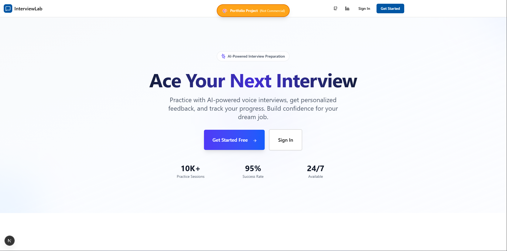
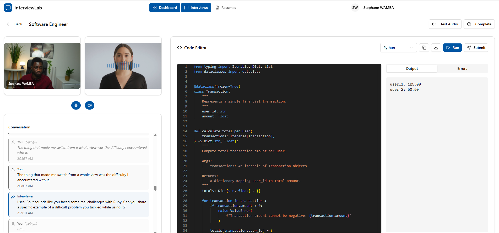
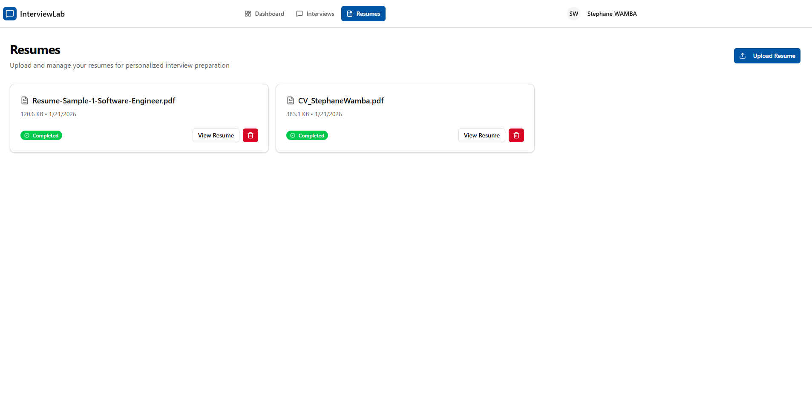
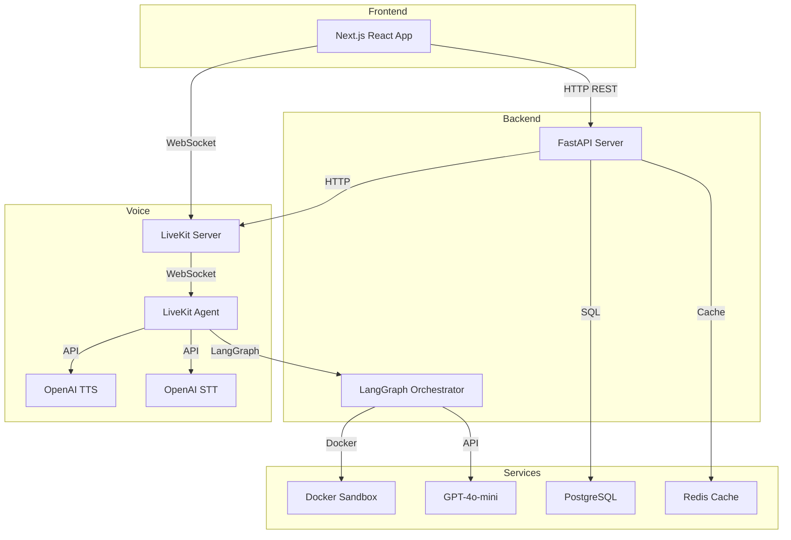
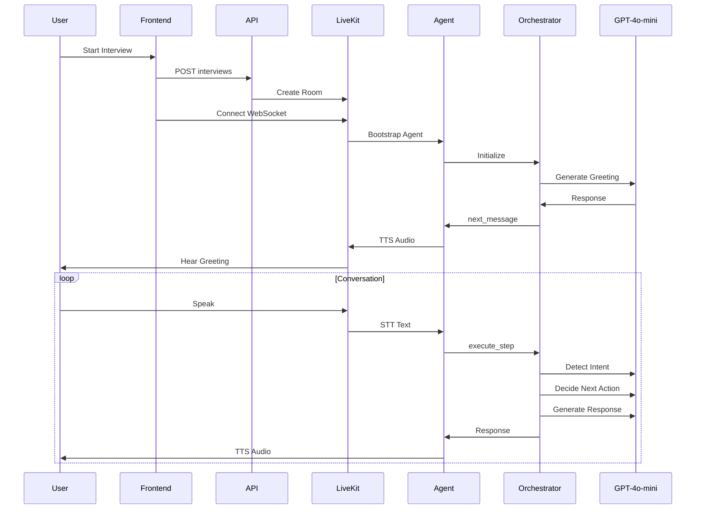

# InterviewLab

<div align="center">
  
  <br/><br/>
  
  <br/><br/>
  
</div>

**Problem:** Traditional interview and language practice often lacks realism, immediate feedback, and interactive voice-based engagement.

**Solution:** InterviewLab delivers AI-driven mock interviews, coding drills, and spoken language practice using real-time voice, live code execution, and in-depth feedback — powered by LangGraph and LiveKit.

---

**Python** `3.11+` **TypeScript** `5.0+` **LangGraph** `0.0.40+` **LiveKit** `0.11.0+` **OpenAI** `1.0.0+` **License** `GNU` **Status** `Portfolio-Project`

Portfolio Project — Production-ready codebase demonstrating AI system architecture.

## Aim

Provide candidates with realistic practice through:

- **Natural voice conversations** with an AI partner (interviewer or language coach)
- **Live code execution** in an isolated sandbox
- **Mode-specific feedback** — interview skills, coding review, or language fluency/grammar/vocabulary
- **Resume-based questions** tailored to candidate background
- **Curated practice topics** for coding drills and spoken language scenarios

## Features

### Session modes

Every session is one of three modes (`session_mode`):

| Mode | Purpose | Voice | Code sandbox |
| ---- | ------- | ----- | ------------ |
| **`interview`** | Full mock technical interview from a resume (+ optional job description) | Yes | Yes |
| **`code_practice`** | Focused coding drill on a curated problem | Yes | Yes |
| **`language_practice`** | Spoken conversation in a target language (English, Japanese, …) | Yes | No |

Legacy rows without `session_mode` are classified from title/job-description markers; older `english_practice` values normalize to `language_practice`.

### Mock interviews

- Upload a PDF resume → AI extracts skills, experience, and topics
- Start a voice interview guided by a LangGraph state machine (intro → exploration → technical → closing)
- Question bank search feeds relevant follow-ups
- Submit code during the session; Docker sandbox runs it and the agent reviews quality
- End-of-session feedback: communication, technical knowledge, problem-solving, code quality

### Practice hub (`/dashboard/practice`)

**Language practice**

- Topic catalog filterable by target language, skill focus (Speaking, Writing, Listening, Grammar, Vocabulary), and level
- Optional **scenes** (role, setting, goal, opening line) so the learner picks a concrete situation
- Live coaching: corrections and vocabulary tips ride along on each turn
- End-of-session language feedback: fluency, grammar, vocabulary, task completion, phrases to learn

**Code practice**

- Problem catalog filterable by category and difficulty
- Same voice + sandbox loop as interviews, scoped to one problem and rubric

### Dashboard & analytics

- Session history with type badges (Interview / Code / language flag)
- Skill averages, progression charts, and multi-interview comparison
- Language sessions surface a dedicated performance breakdown

### Admin

- LLM model / temperature / TTS / skill-weight configuration
- Practice languages list
- Question bank, language topics, code topics, and prompt management
- User roles and API key management

## High-Level Architecture



### Core Components

| Component        | Technology     | Purpose                               |
| ---------------- | -------------- | ------------------------------------- |
| **Orchestrator** | LangGraph      | State machine managing interview flow |
| **Agent**        | LiveKit Agents | Real-time voice agent (STT/TTS)       |
| **LLM**          | GPT-4o-mini    | Question generation, decision making  |
| **Sandbox**      | Docker         | Isolated code execution               |
| **Database**     | PostgreSQL     | Interview state, checkpoints          |
| **Cache**        | Redis          | State caching, session management     |

## How It Works

### Interview Flow



Practice sessions reuse the same voice loop. The orchestrator branches on `session_mode`: language practice skips the sandbox and uses language-specific prompts/feedback; code practice scopes the conversation to a single problem.

### State Management

- **LangGraph MemorySaver**: In-memory state per interview (`thread_id`)
- **Database Checkpoints**: Persistent state after each turn
- **Reducers**: Append-only fields (conversation_history, questions_asked)
- **Single Writer**: Critical fields (next_message, phase) written by one node

## Current Performance

### Strengths

- ✅ **Real-time voice** with <3s latency
- ✅ **Three session modes** (interview, code practice, language practice)
- ✅ **State persistence** via checkpoints
- ✅ **Concurrent interviews** (isolated by thread_id)
- ✅ **Code execution** in isolated Docker containers
- ✅ **Mode-specific feedback** with skill breakdowns

## Project Structure

```
InterviewLab/
├── src/                    # Backend (Python/FastAPI)
│   ├── agents/            # LiveKit agent logic
│   ├── api/               # REST API implementation
│   │   └── v1/
│   │       └── endpoints/ # interviews, resumes, voice, sandbox, practice topics, admin
│   ├── core/              # Config, database, auth, session_modes
│   ├── models/            # Interviews, resumes, practice topics, question bank, …
│   ├── schemas/           # Pydantic schemas for data validation
│   └── services/          # Business logic and subsystems
│       ├── analysis/      # Interview response and code analysis
│       ├── analytics/     # Skill progression and comparison
│       ├── data/          # Checkpoints, topics, question bank
│       ├── execution/     # Secure code sandboxing
│       ├── logging/       # Interview activity logging
│       ├── orchestrator/  # LangGraph flow (interview + practice personas)
│       └── voice/         # LiveKit voice management
├── frontend/              # Frontend (Next.js + React)
│   ├── app/              # Auth, dashboard (interviews, practice, admin, resumes, …)
│   ├── components/       # Interview, practice, analytics, admin UI
│   ├── lib/              # API client and store utilities
│   └── hooks/            # Custom React hooks
├── docs/                  # Documentation and guides
├── alembic/               # Database migration scripts
├── docker-compose.yml     # Local dev orchestration
├── Dockerfile             # Production build configuration
└── pyproject.toml         # Backend dependencies and settings
```

## Documentation

- [Architecture](docs/ARCHITECTURE.md) - System architecture and component relationships
- [API Reference](docs/API.md) - REST API endpoints
- [Frontend](docs/FRONTEND.md) - Next.js frontend architecture and development
- [Voice Infrastructure](docs/VOICE_INFRASTRUCTURE.md) - LiveKit setup and agent architecture
- [User Guide](docs/USER_GUIDE.md) - How to use InterviewLab
- [Local Development](docs/LOCAL_DEVELOPMENT.md) - Setup and development workflow
- [LangGraph Guide](docs/LANGGRAPH.md) - State, nodes, and orchestration
- [Deployment](docs/DEPLOYMENT.md) - Railway and Vercel deployment

## Quick Start

```bash
# Backend
cd src
uvicorn main:app --reload

# Frontend
cd frontend
npm install
npm run dev

# Agent (requires LiveKit server)
python -m src.agents.interview_agent
```

See [Local Development](docs/LOCAL_DEVELOPMENT.md) for detailed setup.

## Tech Stack

### Backend

- **FastAPI** - Modern async web framework
- **Python 3.11+** - Programming language
- **LangGraph 0.0.40+** - State machine orchestration
- **SQLAlchemy 2.0+** - ORM with async support
- **Alembic** - Database migrations
- **LiveKit Agents** - Real-time voice agents
- **OpenAI GPT-4o-mini** - LLM for question generation
- **Instructor** - Structured LLM outputs
- **PostgreSQL** - Primary database
- **Redis** - Caching and state management
- **Docker** - Code sandbox execution

### Frontend

- **Next.js 16.1** - React framework
- **TypeScript 5.0+** - Type safety
- **React 19.2** - UI library
- **Tailwind CSS 4** - Styling
- **Zustand** - State management
- **TanStack Query** - Data fetching
- **Monaco Editor** - Code editor
- **Framer Motion** - Animations
- **LiveKit Client** - WebRTC integration

### Deployment

- **Railway** - Backend and agent hosting
- **Vercel** - Frontend hosting

## License

GNU General Public License v3.0
